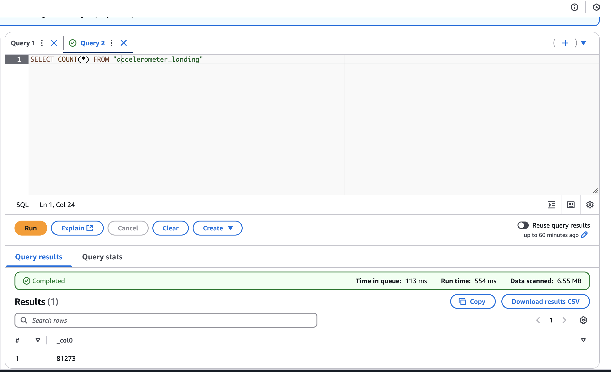
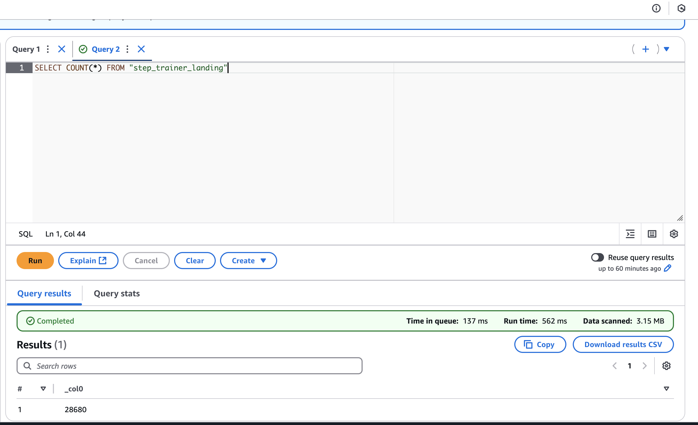
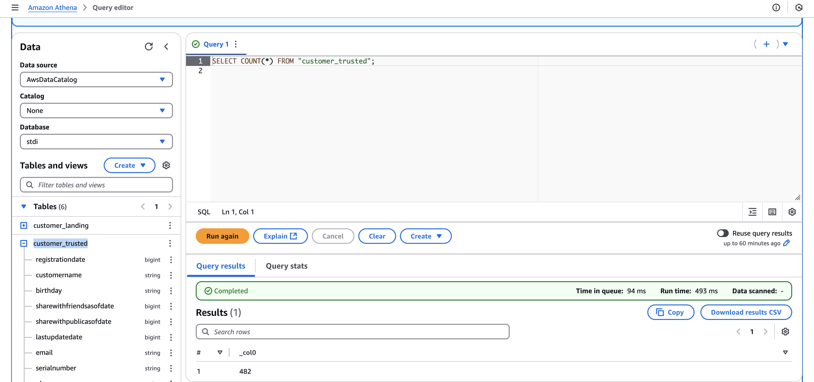
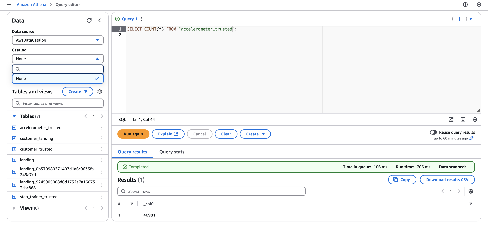
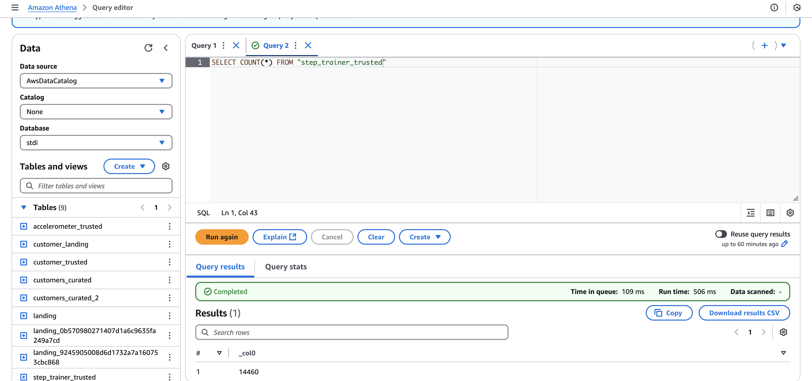
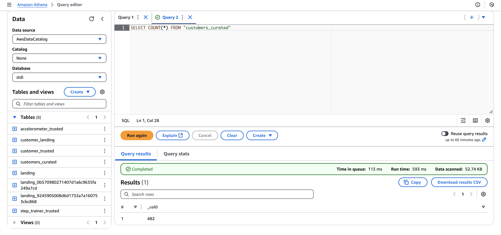
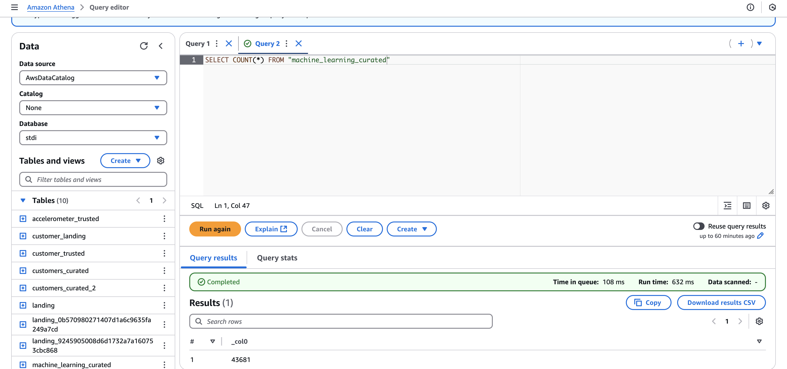

# STEDI Human Balance Analytics

## Project Overview
The STEDI Human Balance Analytics project involves building an ETL pipeline using AWS Glue Studio to process data from IoT devices, customer information, and accelerometer readings. The data is ingested from the Landing Zone, transformed in the Trusted Zone, and finally curated for machine learning analysis.

---

## Data Flow and ETL Process

### Landing Zone
1. **customer_landing_to_trusted.py**: Filters out rows where `shareWithResearchAsOfDate` is blank.
2. **accelerometer_landing_to_trusted.py**: Joins `customer_trusted` with `accelerometer_landing` by `email`.
3. **step_trainer_trusted.py**: Processes trusted data from step trainer records.

### Athena Query Results
**Landing Zone Query Results:**
- `customer_landing`: 956 rows  
  

- `accelerometer_landing`: 81,273 rows  
  

- `step_trainer_landing`: 28,680 rows  
  

### Trusted Zone
**Query Results:**
- `customer_trusted`: 482 rows (No blank `shareWithResearchAsOfDate`)  
  

- `accelerometer_trusted`: 40,981 rows  
  

- `step_trainer_trusted`: 14,460 rows  
  

---

## Curated Zone
1. **customer_trusted_to_curated.py**: Joins `customer_trusted` with `accelerometer_trusted` by `email`.
2. **machine_learning_curated.py**: Joins `step_trainer_trusted` with `accelerometer_trusted` by `sensorReadingTime`.

**Query Results:**
- `customer_curated`: 482 rows  
  

- `machine_learning_curated`: 43,681 rows  
  

---

## Tools Used
- **AWS Glue Studio**: ETL pipeline development  
- **AWS Athena**: Query and analyze data  
- **AWS S3**: Data storage  
- **AWS Glue Data Catalog**: Metadata management  

---

## Screenshots Summary
1. AWS Glue Job Configurations  
2. Athena Query Results  
3. Data Preview Sessions from Glue Studio  
